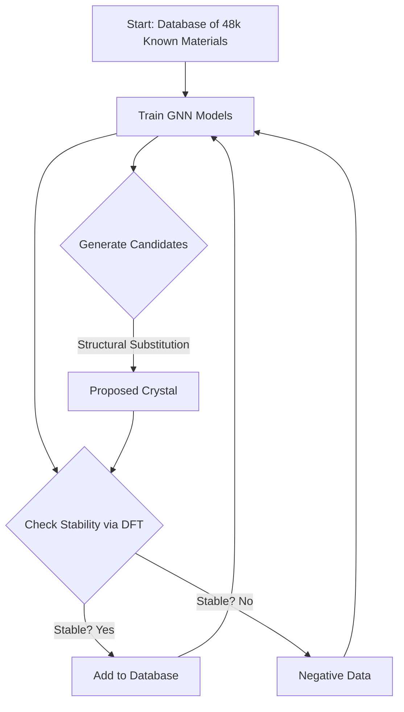
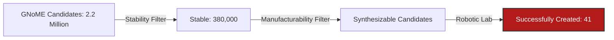

# 800 Years in Weeks: Decoding Google DeepMind's GNoME

**Reference:** *Scaling deep learning for materials discovery* (Merchant et al., Nature 2023).

For the entire history of humanity—from the Bronze Age to the Silicon Age—we have experimentally discovered and characterized roughly **48,000** stable inorganic crystals. These are the building blocks of our civilization: the silicon in your phone, the lithium-cobalt-oxide in your battery, the alloys in your turbine blades.

In late 2023, Google DeepMind published a paper announcing the discovery of **380,000** new stable crystals.

In a few weeks of GPU time, an AI model expanded humanity’s material knowledge by an order of magnitude. This represents not just an acceleration, but a fundamental phase shift in how R&D is conducted.

For engineers in the Energy sector, the immediate question is: **Are these materials real, or are they digital hallucinations?**

---

## 1. The Engine: What is GNoME?
**GNoME** stands for *Graph Networks for Materials Exploration*.

Unlike standard generative AI (which hallucinates text or images), GNoME is grounded in physics. It uses **Graph Neural Networks (GNNs)**—specifically models similar to the ones we discussed in [our previous post](../2025/12/10/atoms-to-algorithms/)—to predict the **Formation Energy** of a crystal.

### The "Stability" Metric
The model doesn't just ask "Can I connect these atoms?" It asks "Is this structure thermodynamically stable?"
*   **Convex Hull:** In thermodynamics, a material is "stable" if it lies on the Convex Hull. If its energy is too high, it will spontaneously decompose into other materials.
*   **The Filter:** GNoME generated millions of candidates, but only the ones predicted to be **Stable** (Energy < 0 eV/atom relative to hull) were kept.

---

## 2. The Innovation: Active Learning
The real breakthrough wasn't the neural network architecture; it was the **Workflow**.

DeepMind used an "Active Learning" loop. They didn't just train the AI once. They set up a system where the AI would propose a material, a rigorous Physics Engine (DFT) would check it, and the AI would **learn from its own failures**.

### Visualizing the Loop
This diagram explains how GNoME "taught itself" physics:

### The Engineering Takeaway:
This is the key lesson for Industrial AI. Quality Control is part of the Training Loop. By feeding the "Failures" back into the model, the AI learned exactly what doesn't work, making it exponentially smarter over time.

---

## 3. The Energy Implications
Why does this matter for the Energy Transition? The discovery wasn't random; it unlocked specific classes of materials critical for Net Zero.

### A. Solid-State Batteries (52,000 New Conductors)
The bottleneck for Electric Vehicles is the liquid electrolyte (flammable, limits voltage). The industry is desperate for **Solid Electrolytes**—ceramics that conduct Lithium ions.
*   **Before GNoME:** We knew of a few hundred viable candidates.
*   **After GNoME:** The model identified **52,000** new layered compounds with potential for ion conductivity.
*   **The Impact:** Even if only 1% are viable, we have just filled the R&D pipeline for the next 50 years.

### B. Carbon Capture & Electronics
The model also identified thousands of new **Layered Compounds** (similar to Graphene). These are prime candidates for:
*   **Electronics:** New tunneling transistors.
*   **Catalysis:** More efficient surfaces for breaking down $CO_2$ or generating Hydrogen.

*   ---

## 4. The Reality Check: The "Synthesis Gap"
This is where we must apply engineering skepticism. **Prediction is not Production.**

The paper claims these materials are "stable." In thermodynamics, this means they *can* exist. It does **not** mean we can manufacture them.

### The "A-Lab" Experiment
To prove these materials weren't just digital fantasies, researchers at Berkeley Lab (LBNL) built the **A-Lab** (Autonomous Laboratory).
*   **The Setup:** A room full of robotic arms, furnaces, and powder dispensers, running 24/7 without humans.
*   **The Mission:** Synthesize 58 of the materials predicted by GNoME.
*   **The Result:** The robots successfully synthesized **41** of them (71% success rate).

### Visualizing the Funnel
This diagram illustrates the "Synthesis Gap" we face in industry:

## The Verdict for ML4MS
GNoME proves that **Discovery is no longer the bottleneck.** We can find materials faster than we can test them.

The bottleneck has shifted to **Synthesis** and **Characterization**.
For the Oil & Gas sector, this means we will soon have access to "Designer Alloys" tailored for specific corrosion environments. But to use them, we need to invest in **Autonomous Testing** (High-Throughput Labs) to validate the AI's predictions against real-world physics.

---
### 🔗 References
*   Merchant, A. et al. "Scaling deep learning for materials discovery." *Nature* (2023). [Link to Paper](https://www.nature.com/articles/s41586-023-06735-9)
*   Ceder, G. et al. "An autonomous laboratory for the accelerated synthesis of novel materials." *Nature* (2023).
*   [DeepMind Blog Post](https://deepmind.google/discover/blog/millions-of-new-materials-discovered-with-deep-learning/)
