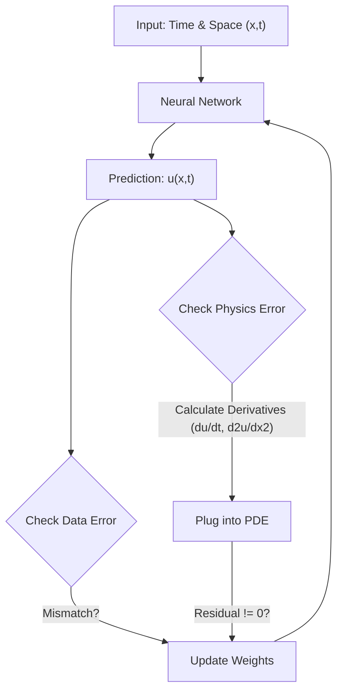

# Beyond FEA: Solving the "Small Data" Problem with Physics-Informed AI

**The central conflict in industrial AI is not compute power; it is data scarcity.**

In the world of Big Tech, AI thrives on abundance. ChatGPT was trained on the entire public internet. Tesla's self-driving models are trained on millions of miles of video footage. In this "Big Data" regime, the strategy is simple: feed the neural network more data until it memorizes the patterns.

But in Heavy Industry—whether Oil & Gas, Aerospace, or Power Generation—we operate in a "Small Data" reality.
*   We do not have millions of examples of a pipeline bursting.
*   We do not have billions of sensor readings for a compressor running at 400°C.
*   We might have **five** catastrophic failures in twenty years.

For a standard Deep Learning model, this is a dead end. If you train a neural network on five data points, it "overfits"—it memorizes those five specific failures but fails miserably when predicting the sixth.

This leads to a widespread skepticism among Senior Engineers: **"If we don't have Big Data, how can we trust AI?"**

The answer lies in a fundamental architectural shift: **Physics-Informed Neural Networks (PINNs).**

---

## 1. The Paradigm Shift: Training on Laws, Not Just Data

Standard AI is purely empirical; it knows only what it sees. PINNs are hybrid; they know what they see, but they also know the Laws of Physics.

### The "Loss Function" Revolution
To understand why PINNs work on small data, you have to look at the mathematical objective function (the "scorecard" the AI uses to grade itself during training).

In a standard Neural Network, the loss function looks like this:
$$ Loss = (Prediction - RealData)^2 $$
The AI simply tries to minimize the distance between its guess and the Excel sheet.

In a **PINN**, we add a second term to the equation:
$$ Loss = (Prediction - RealData)^2 + \lambda(PhysicsViolation)^2 $$

Here, "Physics Violation" isn't a vague concept. It is the **Residual of a Differential Equation**.
If the AI predicts a corrosion rate that violates **Fick’s Law of Diffusion**, or a fluid flow that violates the **Navier-Stokes** equations (Conservation of Mass/Momentum), the model is "punished" during training—even if it matches the data points perfectly.

### The Engineering Analogy
Imagine two engineering students taking a final exam on beam deflection.
*   **Student A (Standard AI):** Has memorized the answer key to the practice test. They can answer those specific questions perfectly. But if you change the load or the length of the beam, they fail. They don't know *why* the answer is what it is.
*   **Student B (PINN):** Has learned the formula $F=ma$ and $E=mc^2$. Even if they have never seen the specific numbers in the question before, they can derive the answer because they understand the governing rules.

By embedding physics directly into the optimization loop, we can train robust models using **1/1000th** of the data required by traditional AI.

---

## 2. The Architecture: How a PINN Works
Unlike Finite Element Analysis (FEA), which requires meshing a geometry into thousands of tiny squares, a PINN is "Mesh-Free." It uses **Automatic Differentiation (AutoGrad)** to calculate derivatives instantly across the entire domain.

### The "Collocation" Point
This is the secret weapon. Standard AI needs labeled data (Real measurements). PINNs can learn from "Collocation Points"—random coordinates in space/time where we *don't* have sensor data, but we *do* know that physics must apply.

*   **Sensor Data:** "At $x=0$, the temperature is 100°C." (Data Loss)
*   **Collocation Point:** "At $x=5$, I don't know the temperature, but I know that heat must dissipate according to the Heat Equation." (Physics Loss)

This allows the AI to "fill in the blanks" between sparse sensors with physically valid predictions.

---

## 3. The Killer App: Inverse Problems & Digital Twins
If we already have ANSYS and Abaqus for simulation, why do we need PINNs?
The answer is **Inverse Problems**.

Traditional FEA is a **Forward Solver**. You give it the material properties (Inputs) and it predicts the stress (Output).
*   *Engineer:* "If the diffusion coefficient is $D$, how fast will it corrode?"
*   *FEA:* "It will corrode at rate $Y$."

But in Asset Integrity, we usually have the opposite problem. We have the sensor data (the result), and we want to know the material state (the cause).
*   *Engineer:* "The pipe wall is thinning at rate $Y$. What is the current diffusion coefficient $D$ inside the steel?"
*   *FEA:* Cannot solve this easily. You have to run the simulation 1,000 times with different guesses to match the curve.

**PINNs can solve Inverse Problems instantly.**
Because the material parameter (like Diffusion Coefficient or Thermal Conductivity) is just another variable in the equation, the Neural Network can "learn" the material property at the same time it learns the prediction.

### Use Case: The Corrosion Digital Twin
Imagine a subsea pipeline equipped with sparse ultrasonic sensors.
1.  **Standard AI:** Tries to extrapolate the corrosion curve based on historical trends. Fails when operating conditions change.
2.  **PINN:** Takes the sparse sensor data and solves the **Time-Dependent Diffusion Equation**.
    *   It identifies that the *Diffusion Coefficient* has changed (perhaps due to a temperature spike).
    *   It recalibrates the physics model in real-time.
    *   It predicts the Remaining Useful Life (RUL) based on the *current* physics, not just past history.

---

## 4. A Practical Experiment
To verify this, I ran a code experiment to see if a Neural Network could solve a differential equation (Harmonic Oscillator) without seeing any training data.

I gave the model **zero** examples of a sine wave. I only gave it the equation:

$$ \frac{d^2u}{dt^2} + u = 0 $$

### The Result
The AI "discovered" the sine wave. By randomly exploring values and being punished whenever the second derivative plus the value didn't equal zero, it converged on the exact physical solution.

*(Insert Colab Graph Here)*

This confirms that for well-defined physics problems, we don't need Big Data. We just need the Equation.

---

## 5. The Strategic Roadmap: PINNs in Heavy Industry
Does this mean the end of FEA? **No.**

PINNs are not yet ready to replace FEA for **Final Design Verification** of a nuclear reactor. The error bounds are not yet as rigorous as a dense mesh analysis.

However, PINNs are the future of **Operations and Digital Twins**.
*   **Design Phase:** Use FEA/CFD (High Accuracy, Slow Speed).
*   **Operational Phase:** Train a PINN to mimic the FEA model (Surrogate Modeling). The PINN runs 1,000x faster, allowing it to be embedded in real-time dashboards or even on edge devices on the rig.

### Summary
For the Materials Engineer, the "Small Data" excuse is no longer valid.
*   If you have Data + Physics, you have enough to build a model.
*   By adopting PINNs, we can move from "Reactive" maintenance (fixing what broke) to "Predictive" integrity (solving the physics of failure before it happens).

---
### 🔗 References
*   **The Seminal Paper:** *Physics-informed neural networks* (Raissi et al., 2019). [Read on arXiv](https://arxiv.org/abs/1711.10561)
*   **Lecture:** [Steve Brunton (UW) on PINNs](https://www.youtube.com/watch?v=H7yC4a-k6bE)
*   **My Experiment:** [View the Colab Notebook Code](https://colab.research.google.com/)
